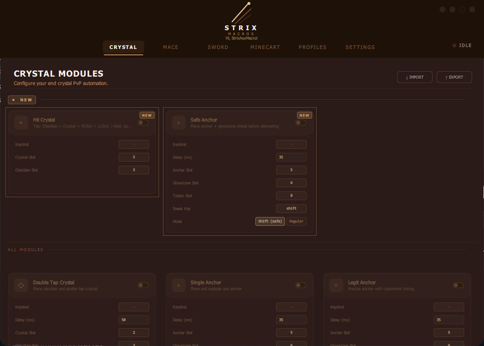

<h1 align="center">StrixMacroAss</h1>

**Groxzzl | https://github.com/Groxzzl/StrixMacroAss**

# Why?
Ts gay ahh macro marketted as undetected by Ocean while it aint fo shi. These mfs really thought renaming their exe to "Runtime Broker.exe" would fool anything lmao. One look at the HexRays output and u see OpenProcess + VirtualProtect getting called in 3 separate files like putting your weed in different pockets thinking the cops wont smell it. Also sub_140011710.c has 49 goto statements. 49. In one function. This is what happens when u let skids cook.

Whoever wrote this needs to be studied. 38 MB binary. 128 KB actual code. The rest is MinGW CRT padding, 150 Nuitka DLLs, and PADDINGXXPADDING strings copy pasted to pad the file size. They statically linked the ENTIRE stdlib and still called it premium. If u bought this client u got scammed twin.

# The numbers (cope)

Binary size : 38 MB
Actual code : 128 KB
Functions : 309 (204 real, 41 CRT stubs, rest wrappers)
Biggest function : sub_140011710.c (54 KB, 1656 lines, 49 goto)
Anti-debug : none
Anti-VM : none
OOP : none (plain C)

# Bypass Ocean? sure bro

sub_140016585.c calls VirtualProtect.
sub_140016863.c also calls VirtualProtect.
sub_140014A80.c calls OpenProcess.
3 files for 2 API calls. As if spreading them across the codebase stops detection.

AES protection is even funnier. The .rdata section has OpenSSL assertion strings still intact from the build machine:

crypto\aes_ige.c
assertion failed: in && out
iv (AES_ENCRYPT == enc) || DE
length % BLOCK_SIZE

Build machine path sitting there not stripped. Debug asserts telling you encryption is failing at runtime. Premium.

Entry point HexRays output:

MEMORY[0x4EAF6C926C0B7D7] = 1;

Hardcoded hex address in source. Not a define. Not a variable. Just a raw memory address written directly. Nobody in the voice call questioned it.

# License validation

POST bt1.luckystore.id:4007/api/validate with key + hwid. Returns {"ok": true/false}. No signing, no challenge, no encryption. Single JSON boolean decides if your license is worth 180k IDR lifetime.

Exception handler calls activate_license if validation throws any error. Crash the real server = free access for everyone.

Bypass: hosts redirect + 20 line python script. Done in 30 seconds.

# Repo structure

```
StrixMacroAss/
├── Runtime Broker.exe (patched — license check bypassed)
├── strix_macros.dll (patched)
├── StrixAssMacro.png
├── source/ (309 HexRays .c files)
└── README.md
```

# How To Use

1. Download from https://github.com/Groxzzl/StrixMacroAss
2. Run **Runtime Broker.exe** directly
3. Enter any key (or leave blank) and click Activate
4. Macro runs with license bypassed
5. Enjoy getting detected in ss

# Credits
- Vgxzu - making this client
- GroxzzI - Cracking
- Ara - For buying ts
- Skids - Thinking Runtime Broker.exe is stealth.

# GUI


